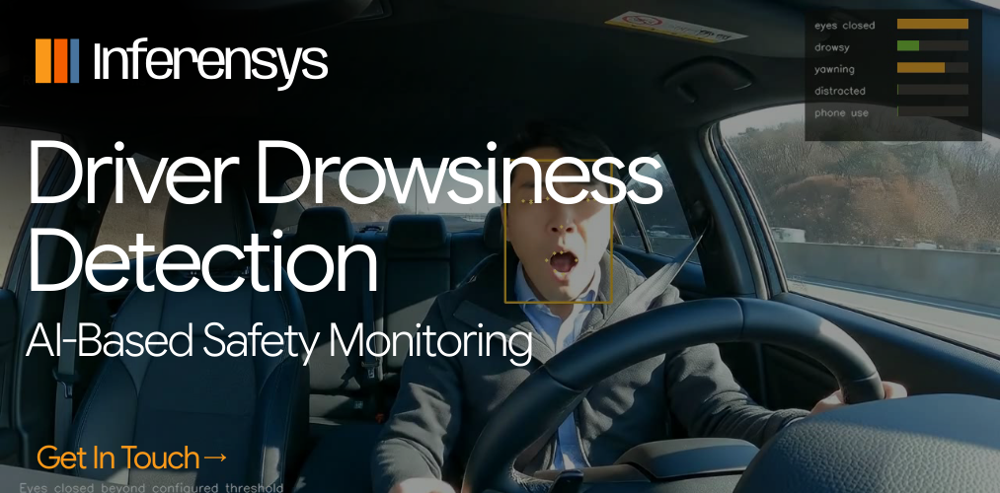

# AI Driver Safety



AI Driver Safety is a practical **driver monitoring system** for assisted and autonomous vehicle cabins. It turns cabin video into a frame-by-frame risk timeline for eye closure, yawning, drowsiness, distraction, and phone use.

The core idea stays close to the original repo: combine computer vision, physiological drowsiness signals, vehicle telemetry, and fuzzy-style risk scoring. The current release proves the vision path with real human cabin recordings and keeps the sensor/vehicle inputs as algorithm extension points.

> Research and demo software only. This is not certified automotive safety software.

## Real Demo

The README demo uses approved human cabin clips only.


**Main demo result**

| Source | Duration | Frames | Detector | Result |
| --- | ---: | ---: | --- | --- |
| User-approved driver cabin clip | 7.96s | 192 | MediaPipe Face Landmarker | `eyes_closed: 111`, `drowsy: 45`, `yawning: 23`, `distracted: 29`; longest unsafe window `3.42s`; estimated runtime `126 FPS` |

**Artifacts**

- [Annotated MP4](docs/demo/real-human-demo.mp4)
- [Session summary JSON](docs/sample-output/real-human-summary.json)
- [Event timeline JSON](docs/sample-output/real-human-events.json)
- [HTML report source run metadata](docs/sample-output/real-human-demo-source.json)
- [Batch summary for all four clips](docs/sample-output/real-human-clip-batch-summary.json)

## Demo Gallery

| Clip | Output | What the system flags |
| --- | --- | --- |
| 1 |  | `eyes_closed: 57`, `drowsy: 20`, `yawning: 12` |
| 2 |  | `eyes_closed: 111`, `drowsy: 45`, `yawning: 23`, `distracted: 29` |
| 3 |  | `eyes_closed: 59`, `drowsy: 9`, `distracted: 65` |
| 4 |  | `eyes_closed: 66`, `drowsy: 38`, `distracted: 79` |


## What A Car/OEM Reader Sees In 60 Seconds

- A real driver video goes in.
- The system writes an annotated MP4, event JSON, CSV, summary JSON, and HTML report.
- The report shows when the driver had eye closure, yawning, drowsy windows, distracted intervals, or phone/object events.
- The same event model accepts physiological drowsiness data and real vehicle telemetry.
- The final output is one risk timeline, not a pile of disconnected demos.

## Algorithm

The scorer is `driver-risk-fusion-v1`.

1. **Vision evidence**: MediaPipe landmarks produce eye aspect ratio, mouth aspect ratio, head offset, face presence, and optional ONNX phone/object detections.
2. **Temporal gating**: frame counters prevent one noisy frame from becoming an alert. Eye closure, yawn, and distraction states must persist for configured windows.
3. **Signal smoothing**: raw per-frame signals are smoothed before risk scoring.
4. **Evidence fusion**: signals are combined with a noisy-OR rule, so multiple moderate cues can raise risk without naive addition.
5. **Cross-signal boosts**: risk increases when combinations matter, such as drowsy + eyes closed, drowsy + yawning, visual fatigue + physiological fatigue, visual fatigue + vehicle risk, or distraction + short time-to-collision.
6. **Explainable outputs**: every alert is written as a `DetectionEvent` with timestamp, frame index, signal, score, severity, bounding box, landmarks, and metadata.

This keeps the original fuzzy-logic concept practical. The system can show why risk rose.

## Original Product Thesis

**Deep learning based driver monitoring system for activity and object recognition.**

Passenger cars need cabin intelligence, not only road perception. A driver monitoring system can read observable cabin cues and vehicle signals to help decide whether the driver is ready to take control, distracted, or fatigued.

The original idea had three parts:

- **Computer vision**: drowsiness, distraction, yawn, eye closure, activity recognition, object recognition, driver ID hooks, hand-gesture hooks, and real-time alerts.
- **Physiological sensing**: heart-rate or wearable-style signals for fatigue and medical-risk cues.
- **Driving style AI**: accelerations, braking, turns, speed, lane drift, time-to-collision, tailgating, and road-context thresholds scored with fuzzy logic.

This repo now implements the first production-shaped path: video analysis, event extraction, fusion scoring, report generation, and demo artifacts from real human recordings.

## Run It

```bash
git clone https://github.com/prasad-kumkar/ai-driver-safety.git
cd ai-driver-safety
python -m venv .venv
source .venv/bin/activate
python -m pip install -e ".[dev,vision]"
python scripts/download_models.py --mediapipe-face
```

Analyze a real driver clip:

```bash
ai-driver-safety analyze \
  --video data/approved-demo/driver-yawning.mp4 \
  --config configs/default.yaml \
  --out runs/real-human-demo
```

Open the generated report:

```bash
open runs/real-human-demo/report.html
```

Regenerate README media from an approved clip:

```bash
python scripts/make_real_demo_assets.py \
  --video data/approved-demo/driver-yawning.mp4 \
  --config configs/default.yaml \
  --out-run runs/real-human-demo \
  --publish-docs \
  --source-name "Approved real driver/yawning clip" \
  --license-note "Approved for public README demo use"
```

Webcam mode:

```bash
ai-driver-safety run --source webcam --config configs/default.yaml
```

## CLI

```bash
ai-driver-safety analyze --video data/approved-demo/driver-yawning.mp4 --out runs/real-human-demo
ai-driver-safety run --source webcam --config configs/default.yaml
ai-driver-safety report --run runs/real-human-demo --format html,json,csv
```

## Python API

```python
from driver_safety import create_pipeline, load_config
from driver_safety.core import FramePacket

config = load_config("configs/default.yaml")
pipeline = create_pipeline(config)
result = pipeline.process_frame(FramePacket(frame=frame, timestamp=0.0, frame_index=0))
```

## Project Shape

```text
driver_safety/
  core/        events, smoothing, alert cooldowns, driver-risk fusion
  vision/      MediaPipe landmarks, EAR/MAR metrics, head offset, ONNX object hook
  io/          video/webcam sources and annotated video writer
  runtime/     analyze/run loops and latency metrics
  reporting/   JSON, CSV, HTML report exports
configs/       default, night-driving, and edge CPU profiles
docs/          architecture, edge notes, demo assets
legacy/        original webcam scripts, Haar assets, heartbeat sketch
```

## Evidence In This Repo

The current proof is intentionally narrow: four approved real human cabin clips supplied by the project owner. No other source media is used in the committed demo.

Committed evidence:

- `docs/demo/real-human-demo.mp4`
- `docs/demo/real-human-demo.gif`
- `docs/demo/real-human-clip-1.gif` through `docs/demo/real-human-clip-4.gif`
- `docs/sample-output/real-human-events.json`
- `docs/sample-output/real-human-summary.json`
- `docs/sample-output/real-human-clip-batch-summary.json`

## Models

Model weights are not committed.

```bash
python scripts/download_models.py --mediapipe-face
```

Optional ONNX phone/object detector:

```yaml
object_detector:
  enabled: true
  provider: onnx
  model_path: models/driver-objects.onnx
  labels_path: models/driver-objects.labels
```

## Development

Keep tests focused on the algorithm and data path:

```bash
ruff check .
mypy driver_safety
pytest
```

## Safety Note

Use this for research, demos, and prototypes. Do not use it as the only safety layer in a real vehicle.


