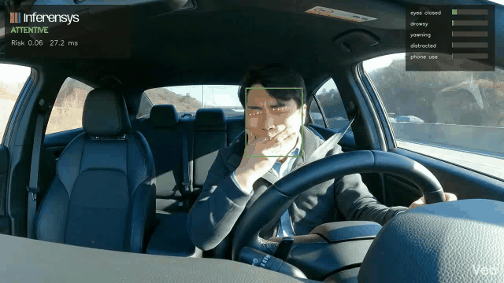
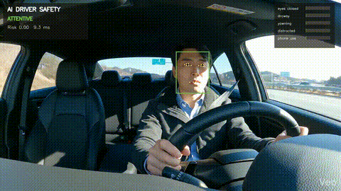
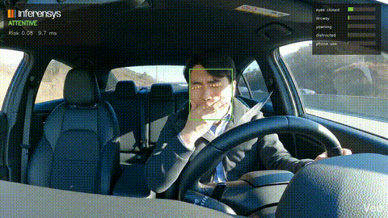
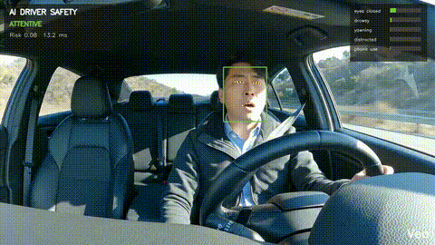
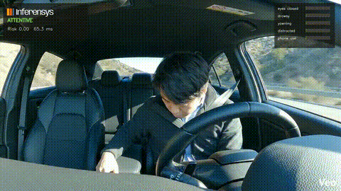
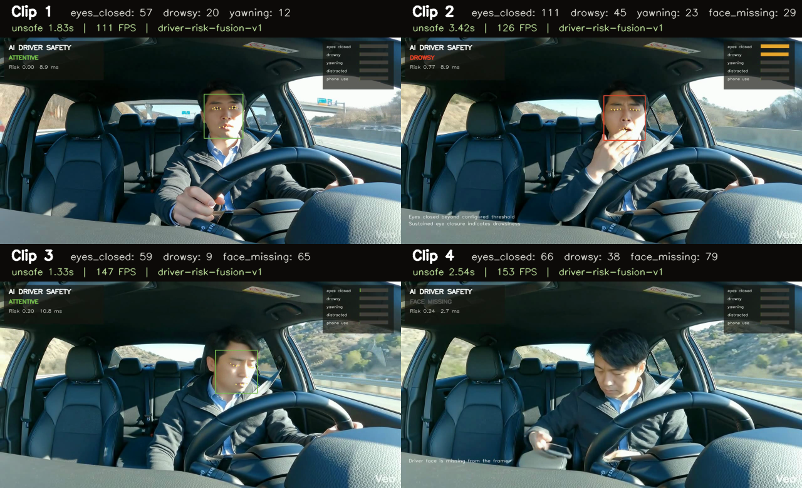
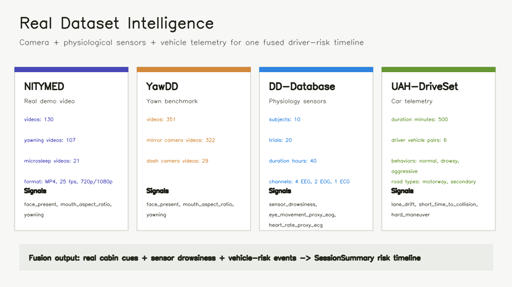

# AI Driver Safety

AI Driver Safety is a practical **driver monitoring system** for assisted and autonomous vehicle cabins. It turns cabin video into a frame-by-frame risk timeline for eye closure, yawning, drowsiness, distraction, phone use, and missing-face events.

The core idea stays close to the original repo: combine computer vision, physiological drowsiness signals, vehicle telemetry, and fuzzy-style risk scoring. The current release proves the vision path first with real human cabin recordings, then keeps sensor and car-data adapters ready for dataset validation.

> Research and demo software only. This is not certified automotive safety software.

## Real Demo

The README demo uses approved human cabin clips. No generated cabin animation is used as public proof.



**Main demo result**

| Source | Duration | Frames | Detector | Result |
| --- | ---: | ---: | --- | --- |
| User-approved driver cabin clip | 7.96s | 192 | MediaPipe Face Landmarker | `eyes_closed: 111`, `drowsy: 45`, `yawning: 23`, `face_missing: 29`; longest unsafe window `3.42s`; estimated runtime `126 FPS` |

**Artifacts**

- [Annotated MP4](docs/demo/real-human-demo.mp4)
- [Session summary JSON](docs/sample-output/real-human-summary.json)
- [Event timeline JSON](docs/sample-output/real-human-events.json)
- [HTML report source run metadata](docs/sample-output/real-human-demo-source.json)
- [Batch summary for all four clips](docs/sample-output/real-human-clip-batch-summary.json)

## Demo Gallery

| Clip | Output | What the system flags |
| --- | --- | --- |
| 1 |  | `eyes_closed: 57`, `drowsy: 20`, `yawning: 12` |
| 2 |  | `eyes_closed: 111`, `drowsy: 45`, `yawning: 23`, `face_missing: 29` |
| 3 |  | `eyes_closed: 59`, `drowsy: 9`, `face_missing: 65` |
| 4 |  | `eyes_closed: 66`, `drowsy: 38`, `face_missing: 79` |



## What A Car/OEM Reader Sees In 60 Seconds

- A real driver video goes in.
- The system writes an annotated MP4, event JSON, CSV, summary JSON, and HTML report.
- The report shows when the driver had eye closure, yawning, drowsy windows, phone/object events, or no visible face.
- The same event model accepts physiological drowsiness data and real vehicle telemetry.
- The final output is one risk timeline, not a pile of disconnected demos.

## Algorithm

The scorer is `driver-risk-fusion-v1`.

1. **Vision evidence**: MediaPipe landmarks produce eye aspect ratio, mouth aspect ratio, head offset, face presence, and optional ONNX phone/object detections.
2. **Temporal gating**: frame counters prevent one noisy frame from becoming an alert. Eye closure, yawn, distraction, and missing-face states must persist for configured windows.
3. **Signal smoothing**: raw per-frame signals are smoothed before risk scoring.
4. **Evidence fusion**: signals are combined with a noisy-OR rule, so multiple moderate cues can raise risk without naive addition.
5. **Cross-signal boosts**: risk increases when combinations matter, such as drowsy + eyes closed, drowsy + yawning, visual fatigue + physiological fatigue, visual fatigue + vehicle risk, or distraction + short time-to-collision.
6. **Explainable outputs**: every alert is written as a `DetectionEvent` with timestamp, frame index, signal, score, severity, bounding box, landmarks, and metadata.

This keeps the original fuzzy-logic concept practical. The system can show why risk rose.

## Original Product Thesis

**Deep learning based driver monitoring system for activity and object recognition.**

Passenger cars need cabin intelligence, not only road perception. A driver monitoring system can read observable cabin cues and vehicle signals to help decide whether the driver is ready to take control, distracted, fatigued, or missing from the camera view.

The original idea had three parts:

- **Computer vision**: drowsiness, distraction, yawn, eye closure, activity recognition, object recognition, driver ID hooks, hand-gesture hooks, and real-time alerts.
- **Physiological sensing**: heart-rate or wearable-style signals for fatigue and medical-risk cues.
- **Driving style AI**: accelerations, braking, turns, speed, lane drift, time-to-collision, tailgating, and road-context thresholds scored with fuzzy logic.

This repo now implements the first production-shaped path: video analysis, event extraction, fusion scoring, report generation, and dataset adapters.

## Run It

```bash
git clone https://github.com/prasad-kumkar/ai-driver-safety.git
cd ai-driver-safety
python -m venv .venv
source .venv/bin/activate
python -m pip install -e ".[dev,vision]"
python scripts/download_models.py --mediapipe-face
```

Analyze a real driver clip:

```bash
ai-driver-safety analyze \
  --video data/approved-demo/driver-yawning.mp4 \
  --config configs/default.yaml \
  --out runs/real-human-demo
```

Open the generated report:

```bash
open runs/real-human-demo/report.html
```

Regenerate README media from an approved clip:

```bash
python scripts/make_real_demo_assets.py \
  --video data/approved-demo/driver-yawning.mp4 \
  --config configs/default.yaml \
  --out-run runs/real-human-demo \
  --publish-docs \
  --source-name "Approved real driver/yawning clip" \
  --license-note "Approved for public README demo use"
```

Webcam mode:

```bash
ai-driver-safety run --source webcam --config configs/default.yaml
```

## CLI

```bash
ai-driver-safety analyze --video data/approved-demo/driver-yawning.mp4 --out runs/real-human-demo
ai-driver-safety run --source webcam --config configs/default.yaml
ai-driver-safety report --run runs/real-human-demo --format html,json,csv
ai-driver-safety datasets intelligence
```

## Python API

```python
from driver_safety import create_pipeline, load_config
from driver_safety.core import FramePacket

config = load_config("configs/default.yaml")
pipeline = create_pipeline(config)
result = pipeline.process_frame(FramePacket(frame=frame, timestamp=0.0, frame_index=0))
```

## Project Shape

```text
driver_safety/
  core/        events, smoothing, alert cooldowns, driver-risk fusion
  vision/      MediaPipe landmarks, EAR/MAR metrics, head offset, ONNX object hook
  io/          video/webcam sources and annotated video writer
  runtime/     analyze/run loops and latency metrics
  reporting/   JSON, CSV, HTML report exports
  datasets/    NITYMED, YawDD, DD-Database, UAH-DriveSet adapters
configs/       demo, night, edge CPU, and internal fixture configs
docs/          architecture, datasets, edge notes, demo assets
legacy/        original webcam scripts, Haar assets, heartbeat sketch
```

## Real Dataset Work

Raw dataset media stays under `data/` and out of git. The repo commits analysis artifacts, charts, and metadata.



| Dataset | Why it matters here | Signals used by this repo | Output |
| --- | --- | --- | --- |
| NITYMED | Real in-car yawning and microsleep video for README-grade demos | `yawning`, `eyes_closed`, `face_missing`, microsleep review windows | annotated GIF/MP4 after access approval |
| YawDD | Real human yawning benchmark across in-car faces, eyewear, and lighting | `mouth_aspect_ratio`, `yawning`, face tracking quality | local annotated video and event timeline |
| DD-Database | Physiological drowsiness data from EEG, EOG, ECG, and annotations | `sensor_drowsiness`, EOG eye-movement proxy, ECG heart-rate proxy | `sensor_events.json`, `sensor_summary.json` |
| UAH-DriveSet | Real car telemetry for driving-style risk | `lane_drift`, `short_time_to_collision`, `hard_maneuver`, `speeding` | `vehicle_events.json`, `vehicle_summary.json` |

Generate the project-level dataset analysis:

```bash
ai-driver-safety datasets intelligence \
  --out docs/sample-output/real-dataset-intelligence.json \
  --markdown docs/sample-output/real-dataset-intelligence.md \
  --chart docs/screenshots/dataset-intelligence.png
```

Dataset artifacts:

- [Dataset intelligence JSON](docs/sample-output/real-dataset-intelligence.json)
- [Dataset intelligence report](docs/sample-output/real-dataset-intelligence.md)
- [DD-Database Dryad file index](docs/sample-output/dd-database-dryad-files.json)

See [docs/datasets.md](docs/datasets.md) for dataset-specific commands and media rules.

## Models

Model weights are not committed.

```bash
python scripts/download_models.py --mediapipe-face
```

Optional ONNX phone/object detector:

```yaml
object_detector:
  enabled: true
  provider: onnx
  model_path: models/driver-objects.onnx
  labels_path: models/driver-objects.labels
```

## Development

Keep tests focused on the algorithm and data path:

```bash
ruff check .
mypy driver_safety
pytest
```

## Safety Note

Use this for research, demos, and prototypes. Do not use it as the only safety layer in a real vehicle.
