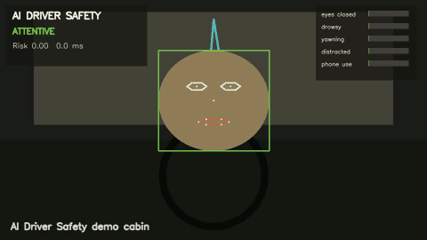

# AI Driver Safety

AI Driver Safety is a local-first **Intelligent Driver Monitoring System** for autonomous and assisted driving use cases. It analyzes camera or video input for drowsiness, eye closure, yawning, distraction, phone use, missing-face states, and driver risk over time.

The project keeps the original framing: computer vision, driver activity recognition, heart-rate and driving-style extension points, fuzzy/risk scoring, and real-time alerts. The revamp turns the old script collection into a package, CLI, report generator, and review dashboard.

> This is an open-source reference application, not certified automotive safety software.

## Demo And Outputs

The repo ships a deterministic demo so a fresh clone can prove the pipeline without downloading restricted human datasets.



- Annotated video: [`docs/demo/ai-driver-safety-demo.mp4`](docs/demo/ai-driver-safety-demo.mp4)
- Live monitor screenshot: [`docs/screenshots/live-monitor.png`](docs/screenshots/live-monitor.png)
- Event timeline screenshot: [`docs/screenshots/event-timeline.png`](docs/screenshots/event-timeline.png)
- Sample events: [`docs/sample-output/events.json`](docs/sample-output/events.json)
- Sample summary: [`docs/sample-output/summary.json`](docs/sample-output/summary.json)

Real dataset intelligence is also generated and committed as project-level analysis, with raw dataset media kept out of git.


- Dataset intelligence JSON: [`docs/sample-output/real-dataset-intelligence.json`](docs/sample-output/real-dataset-intelligence.json)
- Dataset intelligence report: [`docs/sample-output/real-dataset-intelligence.md`](docs/sample-output/real-dataset-intelligence.md)
- DD-Database Dryad file index: [`docs/sample-output/dd-database-dryad-files.json`](docs/sample-output/dd-database-dryad-files.json)

## What It Does

- Analyzes a webcam or video file frame by frame.
- Emits typed driver-state events: `attentive`, `eyes_closed`, `drowsy`, `yawning`, `distracted`, `phone_use`, and `face_missing`.
- Renders an annotated MP4 with overlays.
- Exports `events.json`, `summary.json`, `events.csv`, and `report.html`.
- Provides a local Studio dashboard for reviewing sessions and event timelines.
- Supports MediaPipe Face Landmarker and optional ONNX object detection hooks while keeping model weights out of the repo.

## Project Framing

**Deep Learning based driver monitoring system for activity and object recognition.**

### Problem

Modern passenger cars and assisted/autonomous vehicles need cabin intelligence, not just road perception. By studying a driver's posture, face, body movement, objects, and vehicle behavior, an interior monitoring system can estimate alertness, attention, focus, impairment, and readiness to take control. The same cabin-sensing direction can support passenger position, safety-belt status, forgotten-object detection, multimodal HMI, mood recognition, medical-emergency escalation, and personalized driving experience.

### Solution Approach

AI Driver Safety keeps the original three-path idea and makes it testable:

1. **Computer vision**: identify driver state from camera/video using face, eye, mouth, head-pose, activity, object, and gesture signals.
2. **Physiological sensors**: support heart-rate and drowsiness signals from steering-wheel, wearable, or other biometric inputs.
3. **Driving style AI**: analyze accelerations, braking, turns, speed, lane drift, tailgating, and contextual thresholds with a fuzzy/risk model.

The first reliable release is vision-first, but the architecture intentionally keeps heart-rate and driving-style signals in scope.

### Core Capabilities

- **Driver identification**: recognize the driver so a vehicle can restore preferences and settings.
- **Activity recognition**: detect dangerous activities such as phone use, eating, drinking, looking away, reaching, and passenger interaction.
- **Driver impairment detection**: detect drowsiness, distraction, yawning, eye closure, missing face, and mood-like signals in real time.
- **Attentiveness monitoring**: ensure the driver is looking toward the road and can respond to dangerous situations.
- **Eye/HMI control path**: support future UI selection by gaze or eyes.
- **Hand gesture control**: leave a plugin path for neural-network hand gestures for volume/channel/vehicle controls.
- **Heart-rate monitoring**: support steering-wheel or wearable heart-rate signals for fatigue and medical-risk detection.
- **Alerting**: trigger audio, visual, haptic, or wearable alerts when risk persists.

### Driving Style Classifier AI

The driving-style module treats road behavior as an AI/fuzzy-logic problem. Inputs include:

- Sudden accelerations or decelerations.
- Sudden braking.
- Sharp turns.
- Starts, stops, speed, and turn events.
- Maximum and minimum engine RPM when available.
- Red-light jumps.
- Tailgating cases.
- Aggressive honking.
- Wrong-side overtaking.

The threshold criteria should be contextual. Harsh acceleration on a city road, state highway, and national highway should not use one naive threshold because road type and speed limits change the meaning of the same maneuver.

### Fuzzy Logic Model

The risk classifier follows the classic fuzzy-logic flow:

1. **Fuzzification**: define membership functions and linguistic variables for visual, physiological, and driving-style inputs.
2. **Rules evaluation**: apply fuzzy rules to combine drowsiness, distraction, yawn, eye closure, joy/mood, sensor fatigue, and vehicle-risk signals.
3. **Defuzzification**: convert the fused driver-state estimate into crisp outputs: event severity, risk score, alert, and session summary.

### Novelty

Most driver monitoring demos stop at image processing. This project keeps the stronger original idea: combine computer vision, physiological drowsiness signals, and vehicle driving-style analysis into one driver-risk timeline.

## Quickstart

```bash
git clone https://github.com/prasad-kumkar/ai-driver-safety.git
cd ai-driver-safety
python -m venv .venv
source .venv/bin/activate
python -m pip install -e ".[dev]"
```

Generate the repo-safe synthetic demo and run analysis:

```bash
python scripts/make_demo_assets.py
ai-driver-safety analyze --video samples/demo-driving.mp4 --config configs/synthetic-demo.yaml --out runs/demo
```

Open the report:

```bash
open runs/demo/report.html
```

Run with a real video:

```bash
python scripts/download_models.py --mediapipe-face
python -m pip install -e ".[vision,onnx,api]"
ai-driver-safety analyze --video path/to/driving-video.mp4 --config configs/default.yaml --out runs/real-video
```

Run webcam mode:

```bash
ai-driver-safety run --source webcam --config configs/default.yaml
```

## CLI

```bash
ai-driver-safety analyze --video samples/demo-driving.mp4 --out runs/demo
ai-driver-safety run --source webcam --config configs/default.yaml
ai-driver-safety report --run runs/demo --format html,json,csv
ai-driver-safety studio --run runs/demo
ai-driver-safety datasets intelligence
```

## Python API

```python
from driver_safety import create_pipeline, load_config
from driver_safety.core import FramePacket

config = load_config("configs/default.yaml")
pipeline = create_pipeline(config)
result = pipeline.process_frame(FramePacket(frame=frame, timestamp=0.0, frame_index=0))
```

## Project Structure

```text
driver_safety/
  core/        events, scoring, smoothing, alert policies
  vision/      face landmarks, eye closure, yawn, head offset, object detector hooks
  io/          video/webcam sources and overlays
  runtime/     video and webcam processing loops
  reporting/   JSON, CSV, and HTML exports
  api/         optional FastAPI service
apps/studio/   React/Vite dashboard
configs/       threshold and runtime profiles
legacy/        original scripts and assets
docs/          architecture, datasets, deployment, plugin guide
```

## How It Works

1. **Data acquisition**: webcam, video file, or future RTSP source.
2. **Sensor acquisition**: optional heart-rate, EOG/ECG/EEG, steering-wheel, accelerometer, GPS, lane, and vehicle telemetry.
3. **Pre-processing**: frame timestamps, filtering on sensor data, optional frame skipping, detector setup.
4. **Feature extraction**: deep-learning/computer-vision features for activity and object recognition; sensor features for drowsiness and driving style.
5. **Driver state classification**: smoothed signals become driver-state events.
6. **Fuzzy/risk scoring**: weighted fuzzy-style risk score is computed per frame or sensor interval.
7. **Alerting and reporting**: event timeline, annotated video, JSON/CSV/HTML exports.

## Studio Dashboard

```bash
cd apps/studio
npm install
npm run dev
```

The Studio dashboard is a local review surface for event timelines, signal scores, current driver state, alert stack, and exported artifacts.

## Models

Model weights are not part of the active runtime tree.

```bash
python scripts/download_models.py --mediapipe-face
```

Optional ONNX object detector models should be placed under `models/` and referenced from config:

```yaml
object_detector:
  enabled: true
  provider: onnx
  model_path: models/driver-objects.onnx
  labels_path: models/driver-objects.labels
```

## Validation Datasets

Use real datasets for validation and benchmarking, subject to each dataset's license and access rules. Dataset media and raw sensor files stay under `data/`, which is gitignored.

Generate the project-specific dataset intelligence report:

```bash
ai-driver-safety datasets intelligence \
  --out docs/sample-output/real-dataset-intelligence.json \
  --markdown docs/sample-output/real-dataset-intelligence.md \
  --chart docs/screenshots/dataset-intelligence.png
```

| Dataset | Project Aim | Signals Validated | Output |
| --- | --- | --- | --- |
| YawDD | Real human yawning and mouth-state video | `face_present`, `mouth_aspect_ratio`, `yawning`, camera robustness | local annotated video, event timeline, allowed screenshots only |
| DD-Database | Drowsiness via physiological sensors | `sensor_drowsiness`, EOG eye-movement proxy, ECG heart-rate proxy | `sensor_events.json`, `sensor_summary.json` |
| UAH-DriveSet | Real car-sensor driving style | `lane_drift`, `short_time_to_collision`, `hard_maneuver`, `speeding` | `vehicle_events.json`, `vehicle_summary.json` |

### Real Yawning Video

YawDD is the primary real-human yawning validation track. It contains in-car videos of drivers silently driving, talking/singing, and yawning.

```bash
ai-driver-safety datasets prepare-yawdd \
  --input data/yawdd \
  --participants-info data/yawdd/ParticipantsInformation.csv \
  --out data/manifests/yawdd.json

ai-driver-safety analyze \
  --video "data/yawdd/mirror-camera/23-FemaleNoGlasses-Talking&Yawning.avi" \
  --config configs/default.yaml \
  --out runs/yawdd-23
```

YawDD allows local research use of all videos, but public screenshots are controlled per participant. Do not commit full YawDD videos or annotated derivatives to this repo unless the dataset terms and participant metadata explicitly allow it.

### Physiological Drowsiness Sensors

DD-Database is the primary sensor-drowsiness track. It contains EEG, EOG, ECG, and annotation EDF files collected during a driving-simulator protocol designed to induce drowsiness.

The repo includes a real Dryad file-index sample at `docs/sample-output/dd-database-dryad-files.json`; it is metadata only, not raw physiological data.

```bash
ai-driver-safety datasets dd-index --out data/dd-database/dryad-files.json
ai-driver-safety datasets prepare-dd \
  --input data/dd-database/raw \
  --download-index data/dd-database/dryad-files.json \
  --out data/manifests/dd-database.json

python -m pip install -e ".[datasets]"
ai-driver-safety datasets dd-events \
  --input data/dd-database/raw \
  --out runs/dd-database-sensors
```

### Real Car Sensor Telemetry

UAH-DriveSet is the primary car-sensor validation track. It contains real naturalistic driving sessions with smartphone accelerometer, GPS, lane, vehicle, OpenStreetMap, behavior labels, and trip videos.

```bash
ai-driver-safety datasets prepare-uah \
  --input data/uah-driveset \
  --out data/manifests/uah-driveset.json

ai-driver-safety datasets uah-events \
  --input data/uah-driveset \
  --out runs/uah-driveset-sensors
```

Other useful benchmarks remain supported as future evaluation tracks:

- NTHU Driver Drowsiness Detection Dataset
- State Farm Distracted Driver Detection
- Drive&Act

See `docs/datasets.md`.

## Development

```bash
ruff check .
mypy driver_safety
pytest
```

## Safety Note

AI Driver Safety can support research, prototyping, and product demos. It should not be presented as a certified automotive safety system, and it should not be used as the only safety layer in a real vehicle.
