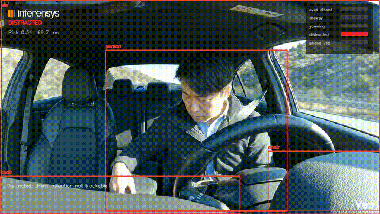

# Deep-Learning based Driver Monitoring

## Why?
In recent years there has been a lot of focus on developing driver monitoring software for integration in passenger cars and other vehicles to facilitate better safety and other functions that improve the user experience. By studying a person’s posture and body movements, intelligent interior vehicle algorithms can draw conclusions about a person’s alertness, attention and focus. Tomorrow’s cabin sensing features will include detection of passenger position, safety belt status and forgotten objects, as well as enabling multimodal functionality such as deeper AI and mood recognition.So the car is able to seamlessly transfer control of the vehicle to an awake and able driver, call for help in a medical emergency, or offer to play the perfect song for the moment.


## Introduction

We present a **driver monitoring system** for assisted and autonomous vehicle cabins. It turns cabin video into a frame-by-frame risk timeline for eye closure, yawning, drowsiness, distraction, and phone use. By combining computer vision, physiological drowsiness signals, vehicle telemetry, and fuzzy-style risk scoring - we can show when the driver is at risk and alert them before it becomes a problem. The system is designed for real-time use on edge devices, and the code is open source for research and demo purposes.

> Research and demo software only. This is not certified automotive safety software.


## Implementation

Using Computer Vision & Deep Learning, we can analyze the driver’s behavior and detect signs of fatigue, distraction, or other unsafe conditions. The system can monitor the driver’s eye movements, facial expressions, and body posture to identify potential risks. For example, if the driver’s eyes are closed for an extended period or if they are yawning frequently, the system can alert them to take a break. Additionally, if the driver is using their phone while driving, the system can detect this behavior and provide warnings to encourage safer driving habits.


1. Data acquisition : A camera module is attached in front of the user which is continuously monitoring the activity of the driver. The hand-grip heart rate sensor embedded onto the steering wheel gives us the bpm of the driver.

2. Pre-processing : Filtering on sensor data.

3. Data processing/ Feature Extraction: AI/ Deep learning-based image processing for detecting the activity of the driver.

4. Classification: Fuzzy classifier to classify the driver’s state by scaling drowsiness, distraction, yawn, eye closure, and joy in real-time based on the threshold values.


| Source | Duration | Frames | Detector | Result |
| --- | ---: | ---: | --- | --- |
| Driver cabin clip | 7.96s | 192 | MediaPipe Face Landmarker | `eyes_closed: 111`, `drowsy: 45`, `yawning: 23`, `distracted: 29`; longest unsafe window `3.42s`; estimated runtime `128 FPS` |

Implementation is divided into the following parts:

### 1. Driver identification:
Identification of the driver in order to allow the vehicle to automatically restore its preferences and settings.

### 2. Activity recognition:
2.1 Deep learning model for recognition of continuous driver’s activity.
2.2 This includes activities such as driver talking on the phone, eating while driving the vehicle. These activities will alert the system and make the driver more aware of the dangerous situation.

### 3. Detecting levels of driver impairment:
3.1 Using a camera and microphone for detecting drowsiness, distraction, yawn, eye closure, and joy in real-time.
3.2 Monitor driver fatigue and alert him when potential drowsiness situation is detected.
3.3 Monitor driver attentiveness by ensuring he’s keeping his eyes on the road and that he is aware of any dangerous situation.
3.4 Pilot a user interface thanks to the eyes by automatically selecting HMI areas.

### 4.Hand gesture control:
A trained neural network to detect hand gestures for volume/ channel control or any other in built functionality of the car.

### 5. Intelligent Steering Wheel
An intelligent steering wheel that monitors the heart rate to detect potential drowsiness of the driver. This is made by embedding the hand-grip heart rate monitor into the steering wheel of the vehicle.

### 6. Alerting the driver:
After detection of the driver’s fatigue while driving, the driver can be alerted with special sensors or an electric impulse bracelet.

## Driving Style Classifier-AI:
The Driving style is simply analyzed by computational methodologies (Artificial Intelligence) and applied computing of transportation.

Implementations of all Classifications Using Fuzzy Logic model
Fuzzy Logic Model-A branch of Artificial Intelligence (AI), which will characterize the uncertainty in the data by adding truth and false concepts from common logic to a machine-generated model.

Aggressive Driving Style Criteria: (Input Variables)
1. Sudden Accelerations or Decelerations
2. Sudden Braking
3. Sharp Turns
4. Set of events like start, stop, speed and turns
5. Maximum and minimum rpm of the engine
6. Number of Red light Jumps
7. Number of Tailgating cases
8. Number of Aggressive Honking
9. Number of Wrong side Overtaking

Steps Involved
1. Fuzzification:
This stage defines the membership functions and linguistic variables of the inputs.

2. Rules Evaluation: In this stage, we will apply the fuzzy logic rules to calculate the output.

3. Defuzzification:
The final conversion of the inputs to crisp results.


## Demo

### Eye closure and yawn events


`eyes_closed: 57`, `drowsy: 20`, `yawning: 12`

### Drowsiness & Yawn timelines


`eyes_closed: 111`, `drowsy: 45`, `yawning: 23`, `distracted: 29`

### Head drop and distracted intervals

 | `eyes_closed: 59`, `drowsy: 9`, `distracted: 65` |


### Phone-use Detection

Uses the  MediaPipe Face Landmarker + ONNX YOLO11s COCO detector on the same cabin video pipeline. The model flags the visible phone as `cell phone`, converts it into `phone_use`, and feeds it into the same risk timeline.



`phone_use: 85` across a `3.5s` interval, `eyes_closed: 66`, `drowsy: 38`, `distracted: 79`; object provider `onnx`; estimated runtime `16 FPS`

## What A Car/OEM Reader Sees

- A real driver video goes in.
- The system writes an annotated MP4, event JSON, CSV, summary JSON, and HTML report.
- The report shows when the driver had eye closure, yawning, drowsy windows, distracted intervals, or phone/object events.
- The same event model accepts physiological drowsiness data and real vehicle telemetry.
- The final output is one risk timeline, not a pile of disconnected demos.

## Algorithm

The scorer is `driver-risk-fusion-v1`.

1. **Vision evidence**: MediaPipe landmarks produce eye aspect ratio, mouth aspect ratio, head offset, face presence, and optional ONNX phone/object detections.
2. **Temporal gating**: frame counters prevent one noisy frame from becoming an alert. Eye closure, yawn, and distraction states must persist for configured windows.
3. **Signal smoothing**: raw per-frame signals are smoothed before risk scoring.
4. **Evidence fusion**: signals are combined with a noisy-OR rule, so multiple moderate cues can raise risk without naive addition.
5. **Cross-signal boosts**: risk increases when combinations matter, such as drowsy + eyes closed, drowsy + yawning, visual fatigue + physiological fatigue, visual fatigue + vehicle risk, or distraction + short time-to-collision.
6. **Explainable outputs**: every alert is written as a `DetectionEvent` with timestamp, frame index, signal, score, severity, bounding box, landmarks, and metadata.


This keeps the original fuzzy-logic concept practical. The system can show why risk rose.

## Run It

```bash
git clone https://github.com/prasad-kumkar/ai-driver-safety.git
cd ai-driver-safety
python -m venv .venv
source .venv/bin/activate
python -m pip install -e ".[dev,vision]"
python scripts/download_models.py --mediapipe-face
```

Enable the phone-use detector locally:

```bash
python -m pip install -e ".[onnx]"
python -m pip install ultralytics onnx onnxslim onnxruntime
python scripts/download_models.py --phone-detector --phone-model yolo11s.pt
```

Analyze a real driver clip:

```bash
ai-driver-safety analyze \
  --video data/approved-demo/driver-yawning.mp4 \
  --config configs/default.yaml \
  --out runs/real-human-demo
```

Webcam mode:

```bash
ai-driver-safety run --source webcam --config configs/default.yaml
```

Python API:

```python
from driver_safety import create_pipeline, load_config
from driver_safety.core import FramePacket

config = load_config("configs/default.yaml")
pipeline = create_pipeline(config)
result = pipeline.process_frame(FramePacket(frame=frame, timestamp=0.0, frame_index=0))
```


## Models

Model weights are not committed.

```bash
python scripts/download_models.py --mediapipe-face
```

ONNX phone/object detector:

```bash
python -m pip install ultralytics onnx onnxslim onnxruntime
python scripts/download_models.py --phone-detector --phone-model yolo11s.pt
```

```yaml
object_detector:
  enabled: true
  provider: onnx
  model_path: models/driver-objects.onnx
  labels_path: models/driver-objects.labels
```


### Threshold Criteria:
(to be set for all classifications) Example- the Threshold for harsh accelerations and decelerations has to be decided in by the System In accordance with the type of Road it is running on For example a city road or a state Highway or a National Highway. Because the speed limits will be different.

## Novelty:
Our solution is a combination of three different approaches, which increases accuracy. This is a more intuitive use of the new generation of driver assistance functions. Most solutions being tested are based on just image processing. Combining computer vision, driving style, and heartbeat analysis and testing them has not been tried before.

## Safety Note

Use this for research, demos, and prototypes. Do not use it as the only safety layer in a real vehicle.


